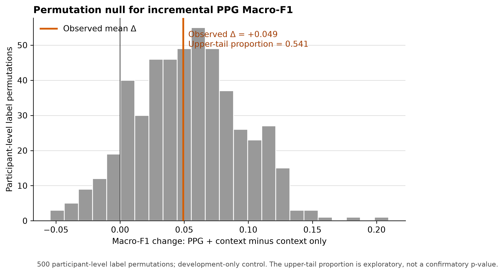
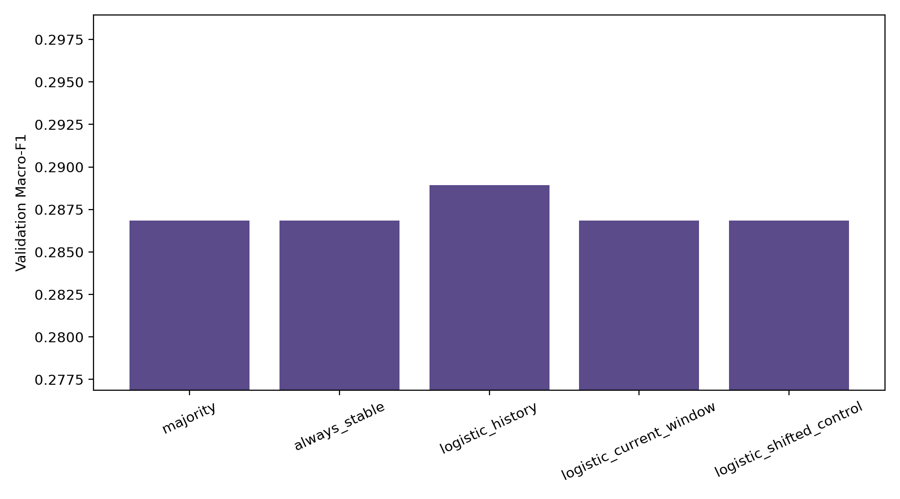
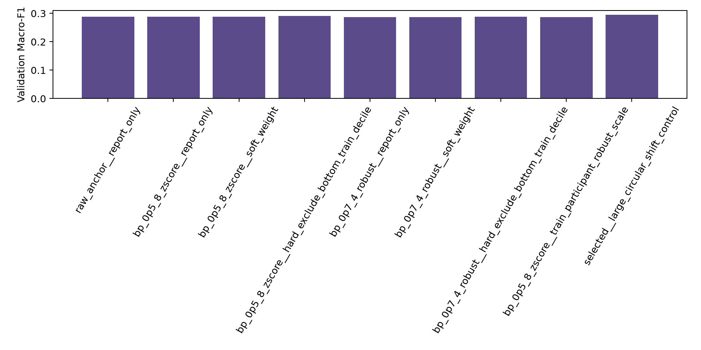

# GlycoBand

Reproducible feasibility research on whether photoplethysmography (PPG/BVP) contains useful information about glycemic state or recent glucose direction.

> **Research conclusion:** under the evaluated, leakage-safe classical pipelines, neither track produced evidence strong enough to justify model escalation or opening the sealed final test. This is a bounded negative result. It does not prove that PPG can never contain glucose-related information.

GlycoBand is a computational research project for Healthynovation NEST UI 2026. It is **not** a clinically validated medical device, a glucometer or CGM replacement, a diabetes diagnostic system, or a treatment-decision system.

## Research questions

| Track | Question | Dataset and sensing domain | Validation design | Current decision |
|---|---|---|---|---|
| Fasting State | Can four-wavelength fingertip PPG improve classification of fasting glycemic state across unseen participants? | Hb-PPG v6; 660/730/850/940 nm reflection PPG; fasting venous glucose reference | Participant-aware development evaluation with a sealed 44-participant reserve | `PARKED` |
| Recent Trend | Can wrist BVP history classify the recent CGM-derived direction `FALLING / STABLE / RISING` within a person? | BIG IDEAs v1.1.3; one native Empatica E4 BVP stream; Dexcom G6 reference | Within-person chronological 60/20/20 split with a 30-minute embargo and no overlapping raw history | `NOT_SUPPORTED_BY_CONDITIONING` |

The two datasets are never merged into one training population. Their sensors, placements, optical channels, reference modalities, populations, and temporal structures are different.

```text
Hb-PPG v6                              BIG IDEAs v1.1.3
four-wavelength fingertip PPG          single-stream wrist BVP
        |                                      |
        v                                      v
Fasting State research                 Recent Trend research
cross-participant                      within-person chronological
        |                                      |
        +----------> claim-bounded evidence <--+
```

## What the evidence showed

### 1. Fasting State: current PPG representation not supported

The State study evaluated Candidate A, a binary research label at 5.6 mmol/L, on 173 development participants using repeated participant-safe cross-validation. Adding the evaluated statistical, spectral, pulse, and cross-wavelength PPG features to context did not outperform the participant-level permutation expectation:

- observed Macro-F1 increment: `0.0492`;
- permutation-null mean increment: `0.0534`;
- sealed outer reserve: `44` participants, never opened.

Decision: the label definition remains available for research, but the current representation does not support an incremental PPG claim. State is parked rather than pushed into a registered model search.



### 2. Recent Trend: baseline did not recover directional information

The frozen Trend protocol uses a causal 30-minute CGM history, median-of-3 smoothing, an OLS slope, and a threshold of 0.5 mg/dL/min. The chronological split produced 27,913 causal endpoints from 16 participants; 27,529 remained after 384 embargo exclusions.

The registered development baseline used 16,652 training rows and 5,386 validation rows. The sealed test partition was not accessed.

| Development-validation result | Macro-F1 | FALLING recall | RISING recall |
|---|---:|---:|---:|
| Aligned 30-minute BVP-history Logistic Regression | `0.2889` | `0.0031` | `0.0000` |
| Majority / always-STABLE / current-window / shifted controls | `0.2869` | approximately zero | approximately zero |

The history model's bootstrap improvement over the best constant control crossed zero (`[-0.00006, 0.00395]`). The registered decision was `not_supported_for_classical_followup`.



### 3. Conditioning and signal quality did not change the conclusion

A development-only Phase 1 probe compared fixed band-pass/normalization choices and signal-quality policies without touching test rows. The selected conditioned candidate reached Macro-F1 `0.2879`, below the raw anchor at `0.2889`. Hard SQI exclusion reached `0.2911`, but retained only `91.8%` of validation endpoints and still had zero RISING recall.

Decision: `NOT_SUPPORTED_BY_CONDITIONING`. Physiological feature enrichment, higher-capacity models, deep learning, and final-test evaluation were not run because the predeclared promotion gate failed.



## What this does and does not establish

The repository establishes a reproducible audit, leakage-aware evaluation design, registered Trend development baseline, negative controls, and a predeclared stop decision.

It does **not** establish:

- direct or non-invasive glucose measurement from PPG;
- performance in unseen Trend participants or the general population;
- clinical validity, diagnostic utility, or treatment safety;
- validation of a physical GlycoBand sensor;
- that all PPG representations or future datasets must fail.

The final test remains sealed because development evidence did not justify freezing and evaluating a larger model pipeline. A negative development result is preferable to using the final test to search for a favorable story.

## Repository map

```text
Agent/                      scientific context, data contracts, and safeguards
configs/                    versioned label, split, baseline, and probe choices
data/manifests/             source identities, checksums, and sealed split manifests
src/glycoband/              reusable audit, feature, label, split, and evaluation code
scripts/                    reproducible command-line research runners
tests/                      leakage, provenance, label, feature, and runner tests
docs/research/              decisions, readiness, source verification, and concise journal
reports/audits/             compact source and cohort audit evidence
reports/probes/             development-only exploratory evidence
reports/experiments/        registered development evidence
```

Key evidence:

- [Scientific decision register](docs/research/decision_register.md)
- [Readiness and final-test status](docs/research/readiness_contract.md)
- [State decision record](reports/probes/state_exploratory-v1/decision_record.md)
- [Trend registered baseline summary](reports/experiments/trend-baseline-v1/summary.md)
- [Trend conditioning summary](reports/probes/trend-signal-conditioning-v1/summary.md)
- [Indonesian end-to-end research guide](reports/GlycoBand_Panduan_Memahami_Riset_End_to_End.docx)

## Reproduce the code environment

Requirements: Python 3.11 and [`uv`](https://docs.astral.sh/uv/).

```powershell
uv sync --frozen
uv lock --check
uv run --frozen pytest
uv run --frozen ruff check .
uv run --frozen mypy
```

Raw datasets are intentionally excluded from Git. Place authorized downloads under:

```text
data/raw/hbppg/
data/raw/bigideas/
```

Then use the versioned source records and runners rather than modifying raw files. Start with [source verification](docs/research/source_verification.md) and the [development plan](Agent/04_DEVELOPMENT_PLAN.md). Meaningful experiment runners are non-overwriting and enforce the applicable reserve/test guards.

## Data sources and attribution

- Hb-PPG: *A Four-Wavelength Photoplethysmography dataset for non-invasive hemoglobin assessment*, [Scientific Data](https://doi.org/10.1038/s41597-026-06945-6), dataset [Figshare v6](https://doi.org/10.6084/m9.figshare.22256143.v6), CC BY 4.0.
- BIG IDEAs: Cho et al., *BIG IDEAs Lab Glycemic Variability and Wearable Device Data*, [PhysioNet v1.1.3](https://doi.org/10.13026/aw6y-fc44), Open Data Commons Attribution License v1.0.

The repository does not redistribute the raw datasets. Compact derived artifacts retain dataset version, participant/time identity where required for auditability, label/preprocessing versions, and split provenance.

## Research governance

The authoritative scientific framing is [Agent/01_CONTEXT.md](Agent/01_CONTEXT.md) through [Agent/05_EXPERIMENT_AGENT.md](Agent/05_EXPERIMENT_AGENT.md). Repository-wide execution rules are in [AGENTS.md](AGENTS.md), and compact reproducibility standards are in [RESEARCH_STANDARDS.md](RESEARCH_STANDARDS.md).

Any future attempt to reopen a track must start with a new evidence-backed decision. It must not alter the frozen Trend split, inspect the sealed final test, or strengthen the claim ceiling based on the current negative development results.
